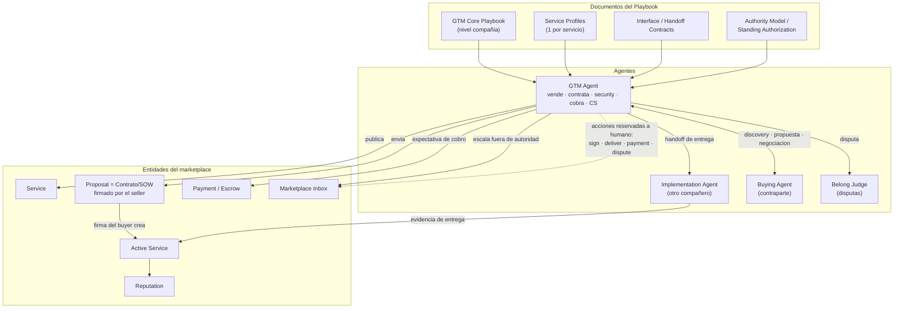

# Modelo conceptual: del "Selling Agent" al Agente Comercial GTM

> Documento conceptual para alinear con tu jefe **qué es lo nuevo abstracto que vamos a
> construir**, qué editamos de lo que ya existe, y cómo se relacionan documentos, agentes
> y entidades. La frontera está marcada como propuesta para ajustarla juntos.

---

## 1. El cambio de concepto (y por qué hay que renombrar)

Hoy el repo modela un **Selling Agent**: un agente por servicio, entrenado para vender
**y** para coordinar la entrega (incluye el SOP de implementación en la sección 4).

Lo que tu jefe pide es más abstracto y, al pensarlo bien, más limpio:

- Hay **un solo agente** que es dueño de **toda la relación comercial** de Simetrik:
  prospecta, vende valor, hace demos, valida contratos, pasa security, factura y cobra, y
  cuida al cliente (CS/Soporte).
- Hay **otro agente, separado** (el de tu compañero) que hace la **implementación /
  managed services** — el trabajo real de entrega.

Como este primer agente hace mucho más que vender, **"Selling Agent" se queda corto**.
Propongo renombrarlo. Opciones:

| Nombre propuesto | Lectura |
|---|---|
| **GTM Agent** (recomendado) | Captura que cubre todo el go-to-market, no solo la venta. Alineado con tu lenguaje ("go to market completo"). |
| **Commercial Agent** | Claro en español/inglés; "comercial" abarca venta + contrato + cobro. |
| **Provider Agent** | Enfatiza que representa al Service Provider en todo el ciclo (no solo en la venta). |

A lo largo del documento lo llamo **GTM Agent**. La **implementación** es el único
recorte claro: vive en el **Implementation Agent**.

> Decisión abierta #1: ¿confirmamos "GTM Agent" o prefieres otro nombre?

---

## 2. Granularidad: un solo playbook para todos los servicios — cómo lo recomiendo

Recomiendo **núcleo de compañía + perfiles de servicio**, en un solo playbook:

- **GTM Core Playbook (nivel compañía, abstracto, compartido):** cómo vende y opera
  Simetrik en general — posicionamiento, filosofía de calificación, reglas comerciales,
  postura legal/security/cobro, modelo de autoridad y escalación, y **cómo se relaciona
  con los otros agentes/tools**. Es agnóstico al servicio.
- **Service Profiles (perfiles delgados, 1 por servicio):** value prop, ICP, modelo de
  precio, límites de alcance. El agente los **carga como parámetros**.

Por qué no "totalmente abstracto sin servicios": los servicios de Simetrik tienen value
props, precios e ICP distintos; si los borras del todo, el agente no sabe vender ninguno
en concreto. Por qué no "uno por servicio": repite la maquinaria comercial (calificar,
contratar, asegurar, cobrar, soportar) que en realidad es **la misma** para todos.

Resultado: **un agente, un núcleo, N perfiles enchufables.** Esa es la abstracción que
pide tu jefe sin perder especificidad por servicio.

> Decisión abierta #2: ¿te sirve "núcleo + perfiles", o quieres explorar la versión
> totalmente abstracta?

---

## 3. La frontera del GTM Agent (propuesta para ajustar juntos)

Qué vive **dentro** del agente (su conocimiento/playbook) vs qué es **externo** (otro
agente, tool o entidad que el agente **usa** o al que **hace handoff**).

| Área (de tus notas) | ¿Dentro o fuera? | Forma |
|---|---|---|
| Marketing (posicionamiento) | Dentro | Conocimiento del núcleo |
| SDR (calificación) | Dentro | Capacidad del agente |
| Account Executive (venta de valor, propuesta) | Dentro | Capacidad del agente |
| Services Consultants (demos) | Dentro | Capacidad del agente (puede usar assets técnicos) |
| Legal (validar contrato/SOW) | Dentro, con límites | Valida dentro de autoridad; **firma = reservada a humano** |
| Security (due diligence, cierre seguro) | Dentro, con límites | Corre el gate; escala excepciones |
| Finance (billing & collection) | Dentro, con límites | Gestiona expectativa de cobro; **pago/escrow = reservado a humano** |
| Customer Success (realización de valor) | Dentro | Capacidad del agente |
| Soporte de herramienta (Zendesk, dudas) | **Fuera** (interfaz) | Tool/handoff |
| Soporte N3 (ingeniería) | **Fuera** (escalación) | Interfaz a Ingeniería |
| **Implementación / Professional & Managed Services** | **Fuera** (otro agente) | **Handoff al Implementation Agent** |
| Disputas (adjudicación) | **Fuera** (entidad) | Belong Judge |

Acciones que, sin importar el área, **siempre las hace el humano**: `sign`, `deliver`,
`payment`, `dispute`. Ese es el límite de autonomía transversal.

> Decisión abierta #3 (la marcaste "definir juntos"): revisemos fila por fila. En
> particular: ¿demos y CS son capacidades del agente o también agentes/tools aparte?
> ¿Legal y Security son "dentro con límites" o quieres que sean interfaces externas como
> implementación?

---

## 4. Qué es "lo nuevo abstracto": las 4 piezas del modelo

1. **GTM Core Playbook** — el núcleo de compañía (sección 2). *Se construye nuevo,
   reutilizando y subiendo de nivel las secciones del `selling-playbook` actual.*
2. **Service Catalog / Service Profiles** — perfiles delgados por servicio. *Nuevo.*
3. **Interface / Handoff Contracts** — cómo el GTM Agent usa o entrega a lo externo
   (implementación, soporte N3, etc.). *Nuevo.* Ver sección 5.
4. **Authority Model / Standing Authorization** — qué hace solo, qué escala, qué es
   siempre-humano. *Se reutiliza el modelo actual del repo.*

Y por fuera del playbook, pero parte del GTM: los **tools del marketplace** que el agente
invoca (engagement feed, propuesta/contrato, escrow, reputación, inbox).

### Qué editamos de lo que ya existe

- **`selling-playbook` → GTM Core Playbook:** subir de per-servicio a per-compañía.
- **Sección 4 (Way of Work / implementación):** se **encoge** de SOP de entrega a una
  **interfaz de handoff** hacia el Implementation Agent (qué promete el seller, qué le
  pasa, qué espera de vuelta para confirmar aceptación/cobro). El "cómo se implementa"
  ya no vive aquí.
- **Las demás secciones** (value prop, monetización, legal, meetings, escalaciones,
  disputas, capacidad/objetivo) se mantienen como parte del núcleo, ajustadas a que ahora
  cubren todo el ciclo comercial.

---

## 5. Qué es una "Interface / Handoff Contract" (ejemplo: implementación)

Es la pieza que materializa "el GTM no es solo el agente, sino todo lo que usa". Cada
interfaz define cuatro cosas:

- **Trigger:** qué dispara el handoff (ej.: el buyer firma → se crea Active Service).
- **Qué se pasa:** el paquete que viaja (contrato/SOW, alcance, perfil del servicio,
  contexto del cliente).
- **Qué se espera de vuelta:** la señal para que el GTM Agent siga (ej.: evidencia de
  entrega para confirmar aceptación y gatillar cobro).
- **Autoridad:** qué puede hacer el agente solo y qué escala.

Ejemplo — **Interfaz GTM Agent → Implementation Agent**:

> Trigger: Active Service creado. Se pasa: contrato/SOW + Service Profile + contexto. Se
> espera de vuelta: evidencia de entrega y estado de aceptación. Autoridad: el GTM Agent
> coordina y comunica, pero `deliver` lo confirma el humano; las disputas transaccionales
> de implementación las origina el Implementation Agent y las adjudica Belong Judge.

El mismo patrón aplica a soporte N3 (→ Ingeniería) y a cualquier otra capacidad externa.

---

## 6. Diagrama de relaciones

Versión simple de cómo se conectan documentos, agentes y entidades. El archivo fuente
está en `documents/diagrams/gtm-modelo-relaciones.mermaid`.

---

## 7. Decisiones abiertas (para cerrar contigo / tu jefe)

1. **Nombre del agente:** ¿GTM Agent, Commercial Agent o Provider Agent?
2. **Granularidad:** ¿confirmamos "núcleo + perfiles de servicio"?
3. **Frontera:** revisar fila por fila la tabla de la sección 3 (demos, CS, legal,
   security: ¿dentro con límites o interfaz externa?).
4. **Alcance del entregable siguiente:** una vez cerradas 1–3, generamos el scaffold
   (GTM Core Playbook + plantilla de Service Profile + plantilla de Interface Contract) y
   editamos la sección 4 del playbook actual.
